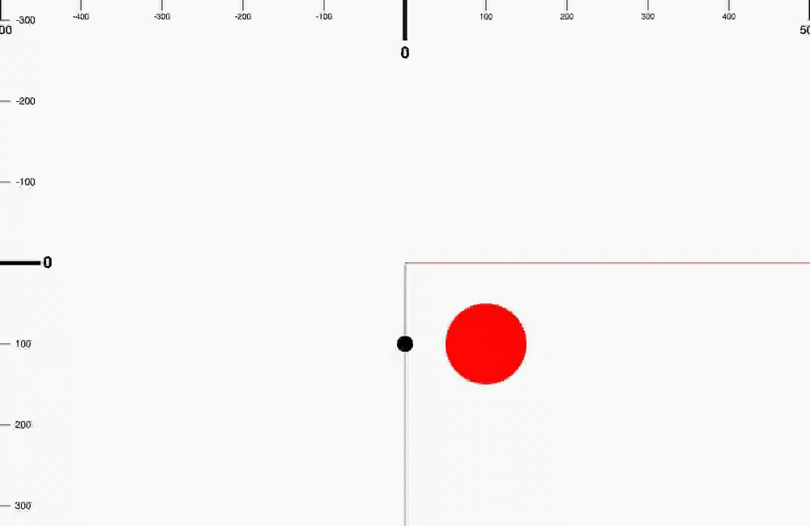
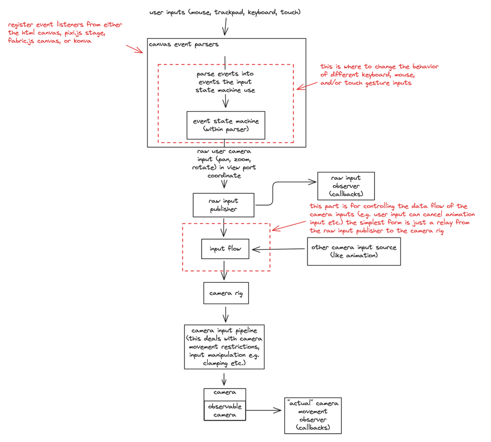
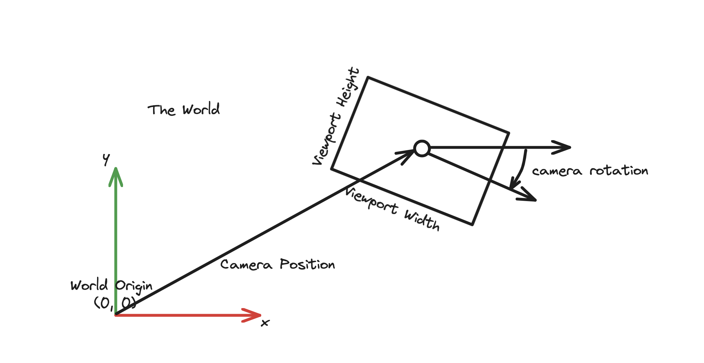
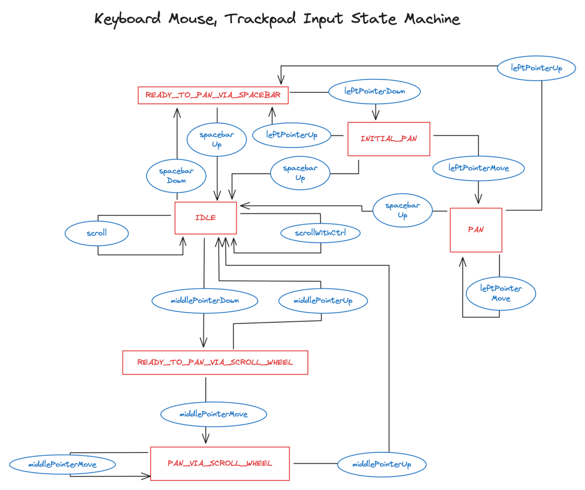
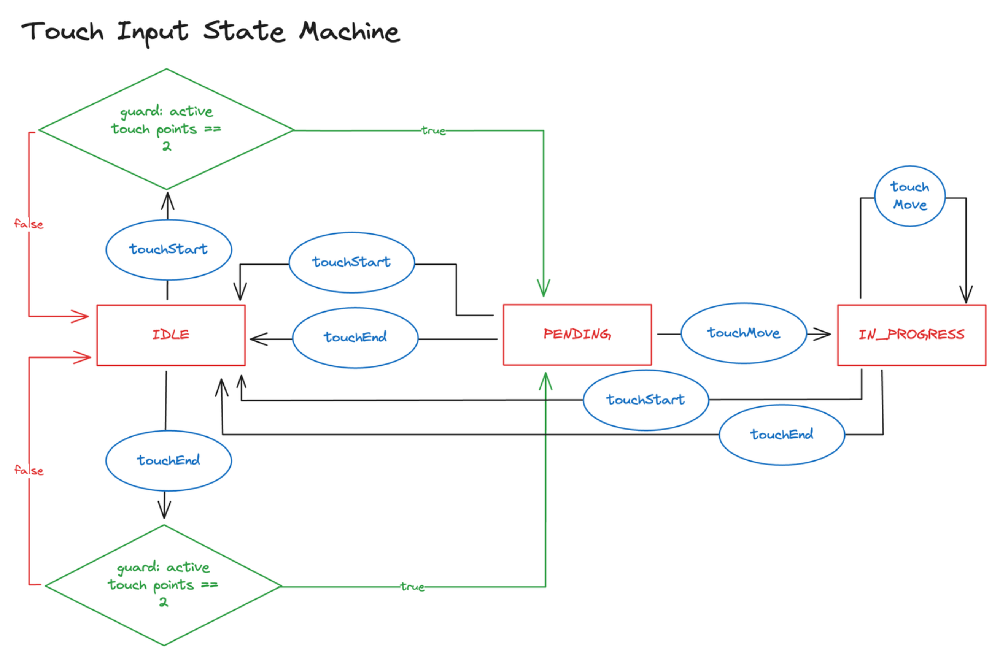

<h1 align="center">
    board
</h1>
<p align="center">
    board supercharges your html canvas element giving it the capabilities to pan, zoom, rotate, and much more.
</p>
<p align="center">
    <a href="https://www.npmjs.com/package/@niuee/board">
        
    </a>
    <a href="https://github.com/niuee/board/actions/workflows/node.js.yml">
        
    </a>
    <a href="https://github.com/niuee/board/blob/main/LICENSE.txt">
        
    </a>

</p>

<p align="center">
  •
  <a href="#install">Install</a> •
  <a href="#key-features">Key Features</a> •
  <a href="#quick-start-using-only-html-canvas">Quick Start</a> •
  <a href="#development">Development</a>
  <a href="#under-the-hood-a-rather-brief-overview">Structural Overview</a>
</p>



_This is is a small demo of what board is capable of. (only showing a small fraction)_

This is not a complete package of drawing app like excalidraw or tl;draw, but a library which you can build on top of to make an app like excalidraw.
board lets you skip the hassle of manually implementing panning, zooming, and rotating functionalities on the HTML canvas element, and well a little bit of math.

What `board` is trying to do is very much like what [pixi-viewport](https://github.com/pixijs-userland/pixi-viewport) is doing. But `board` takes a step back, it's not heavily integrated with pixi.js. It can be used with just regular HTML canvas element without pixi.js, but it also works with canvas that uses [pixi.js](https://github.com/pixijs/pixijs), [fabric.js](https://github.com/fabricjs/fabric.js), and [konva](https://github.com/konvajs/konva).

[CodeSandbox link](https://codesandbox.io/p/sandbox/drp5c7): with a minimal example showcasing the basic functionality that `board` can achieve.

There are a few more examples in the `devserver` directory. Including how to integrate with pixi.js, fabric.js, and konva.

## Docs
- [API Documentation](https://niuee.github.io/board/index.html)
- [中文文件連結](https://niuee.github.io/board/zh-tw/index.html) (還在努力補沒翻完的，還要開發新功能，時間真的不太夠 u.u)

## Installation and Usage
### Package manager
install it using
```bash
npm install @niuee/board
```
and import it like
```javascript
import { Board } from "@niuee/board";
```

### Download From Github
Download the bundled JavaScript (board.js) in the [releases](https://github.com/niuee/board/releases/) page of the repository and put it in the your project directory for other JavaScript module to import like this.
```javascript
import { Board } from "./board.js";
```

### Import From jsdelivr
```javascript
import { Board } from "https://cdn.jsdelivr.net/npm/@niuee/board@latest/index.mjs";
```

### Use iife bundle
In an HTML file use the script tag. (instead of importing from jsdelivr you can also download it as source and put it in you project folder directly)
```html
<script src="https://cdn.jsdelivr.net/npm/@niuee/board@latest/iife/index.js"></script>
```

and then in other JavaScript module you can use the exports of @niuee/board using the name Board.some export

For example the constructor for the `Board` class.
```javascript
const newBoard = new Board.Board(canvasElement);
```

## Key Features
- Modularity: you don't have to use everything from this library; take only what you need. (details in the later section)
- Supports a wide variety of input methods. (touch, trackpad(macOS), keyboard mouse) But you can still tweak how things work.
- Works with just HTML and JavaScript but also works with frontend frameworks/libraries with a little bit of extra work. (example is on the way)
- You can use this with pixi.js, fabric.js, Konva; or maybe just html canvas. (example is on the way)

## Quick Start (Using only HTML canvas)
The `Board` class extends an existing canvas element in the DOM to have extra capabilities such as pan, zoom, and rotation.
To instantiate a new board, you need have a canvas element in your html.
```html
<canvas id="board"></canvas>
```

Call the step function of the `Board` class and in a `requestAnimationFrame` callback.
```javascript
import { Board } from "@niuee/board";

const canvasElement = document.getElementById("board");
const board = new Board(canvasElement); // if you are using this library through iife don't use the variable name board since it would have name conflict with the library

// this is the callback function for the requestAnimationFrame
function step(timestamp){
    // timestamp is the argument requestAnimationFrame pass to its callback function

    // step the board first before everything else because stepping the board would wipe the canvas
    // pass in the timestamp as it is to the board's step function.
    board.step(timestamp);

    // do your stuff

    // and then call the requestAnimationFrame
    window.requestAnimationFrame(step);
}

// start the animation loop
step(0);
```
Now the board should have the basic functionalities like pan and zoom. But there's probably nothing on your canvas.

The default coordinate system @niuee/board uses is the same as the one of the canvas API which is "Down" for positive Y direction.

To draw stuff on the board first get the 2d context of the board.
```javascript

// draw a circle at the location (10, 10)
board.context.beginPath();
board.context.arc(10, 10, 5, 0, 2 * Math.PI);
board.context.stroke();
```

This would result in a circle drawn to the bottom right of the origin. The same as a regular canvas. (but you can pan and zoom the canvas around)

This is probably a good time to talk about coordinate system. The `Board` class has an attribute `alignCoordinateSystem` if set to `false` would result in a reversed y axis.
Meaning positive y goes up in the screen.

Setting `alignCoordinateSystem` would also require an update to the context which you use to draw stuff. After altering the value of `alignCoorindateSystem` if you have previously stored the value of `board.context` somewhere you would need to update that value by calling `board.context` and use the returned value to udpate the stored value.

Without updating the context, the stuff you draw would probably result in a weird state. (everything is reversed in terms of y) `board` takes care of this by using `Proxy` so you don't have to remember to negate the y value when you set `alignCoorindateSystem` to false.

## Development
The dev environment setup for this project is relatively simple. Let me break down the different aspects.
- Bundling (rollup): `pnpm build` Bundling is done through rollup. There's a `rollup.config.js` in charge of that. Every subdirectory in the `src` directory gets its own bundled index.js file.
- Unit Testing (jest): `pnpm test` There's not a lot of tests right now. Only the core functionalities revolving around the camera are unit tested. The next section I will move on to test is the input state machine.
- Dev Server (vite): `pnpm dev` The `devserver` directory contains the current examples of the board. It's sort of like a playground. The more complete example is the in the `main.ts` file.
- Docs Dev Server (vite): `pnpm dev:docs` would spin up a docs server serving files from the directory `docs-staging`
- Documentation (typedoc): `pnpm doc:default` would generate a `docs-staging/en` and then `pnpm doc:move2prod` would copy the entire `docs-staging` to `docs`
- Translation: __Pending__ This is a work in progress probably not going to be ready for the version 0.2 release. The flow of how things should be done is still in discussion.

To start developing `board` first clone the repo.

Then install the dependencies using

```bash
pnpm i
```

And then off you go! You can modify however as you like it.

The [API documentation](https://niuee.github.io/board/index.html) has all the APIs listed.

## Under the Hood (a rather brief overview)

#### Data Flow
How board achieve the effect of infinite canvas is through a camera abstraction. It's like the viewport attribute of svg. 

The user controls the position, zoom, and rotation of the camera to see different parts of a canvas context.

i.e. if you draw a circle with the center at (100, 100) on the context, if the position of the camera is at (100, 100) the cirle would appear in the center of the canvas element.

Everything starts with an user input: a pointer down event, or a touchstart event.
These events are captured by the event listeners added to the canvas element. Then, the event listeners would parse the raw events into a more granular events like: `LEFT_POINTER_MOVE`, `SPACEBAR_DOWN`, etc.

These parsed events are then fed into the input state machine to interpret the user's intent.

The input state machine would spit out something like pan with some distance, or zoom to X scale, etc. 
These are called the raw user inputs (meaning that they exist in the viewport coorindate system instead of the canvas context or the world coordinate.)

The raw user inputs are broadcast by the raw user input publisher to the subscribers including the flow control.

The flow control is where different sources of camera input are coordinated. This is in place to prepare for animated camera input.
(an example ruleset on how different kinds of input affect each other is: user input would take precedence over animated input on both zoom and pan meaning user can cancel animated camera movement)

You might not need this kind of functionality so there's a very basic flow control in place as the default that is just a simple relay.

The flow control then pass the desired camera input through `CameraRig`; this is essentially a pipeline that will perform a series of transformation on the camera inputs. 
(e.g. clamping the translation so that the camera does not move out of boundary; restrict camera movement in certain axis)

Below is a diagram on the data flow.


You can customize the data flow however you want. Heck you can probably plug directly from an event listener to the camera skipping all of the above.

For simplicity, the overarching class `Board` takes care of it all, but if you want customization you'll have to get familiar with the data flow and see which part best fits your need for customizing.

Detail on each part will be on the documentation site (not the API documentation, but more on how and why on the various parts of `board` and a few examples) I'll setup later but probably after the version 0.2 release.

There's one more thing about the data flow, since it's starting from event listeners all the way to the canvas context. This does not work if you want to use an offscreen canvas on a worker thread. This is a planned feature but will not be in version 0.2.

#### Coordinate System
Since the user controls where the camera (viewport) is, how big the camera is, and the rotation angle of the camera, it's coordinate system will deviate from the context/world coorindate system. 


`board` provides a few sets of coordinate conversion helper functions. Most of them are in the `src/board-camera/utils/coordinate-conversion.ts` file.

#### Input State Machine
In the [Data Flow](#data-flow) section I mentioned the state machine that is used to interpret user intentions. 
The state diagram for keyboard mouse, and trackpad input is shown below:


The state diagram for touch input is shown below:


You can customize how the state machine works by defining the relationship between each state in a state machine. There's a tiny library within `board` that's dedicated for this purpose.
Look into the `src/being` directory for more. (Detailed documentation will follow with the documentation site mentioned in the [data flow](#data-flow) section)

## TODO
There is a lot of util stuff that I don't think will fit in here in the readme. So stay tuned for the documentation site!
